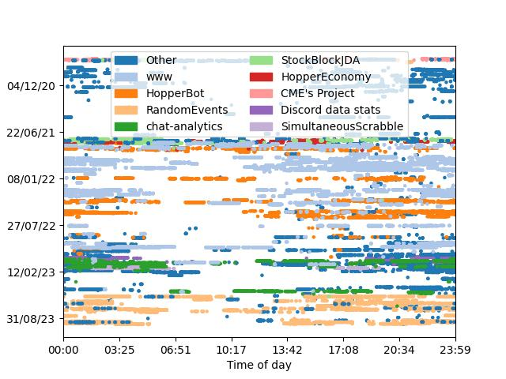
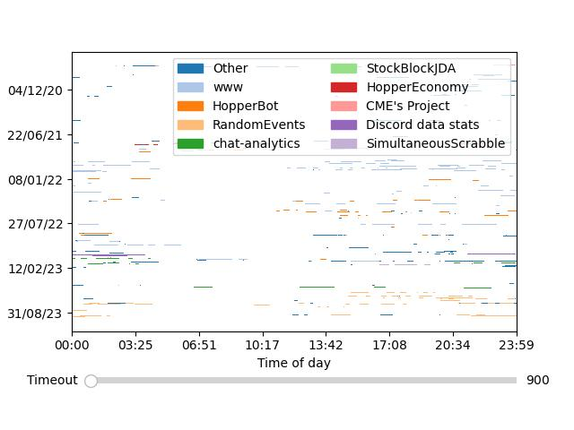
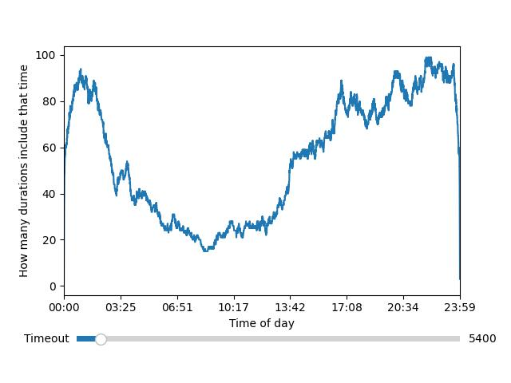
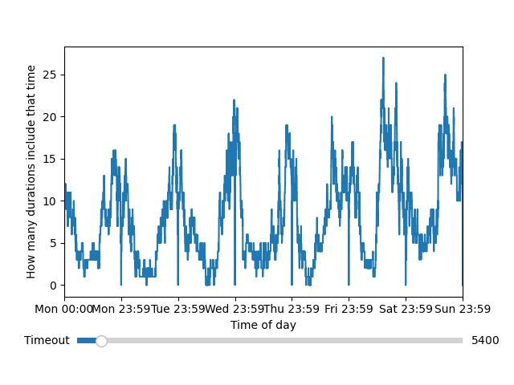
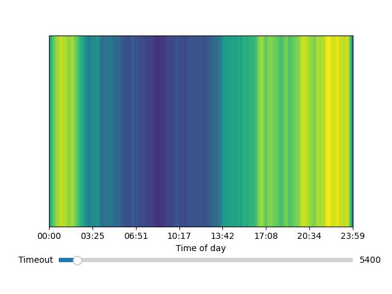
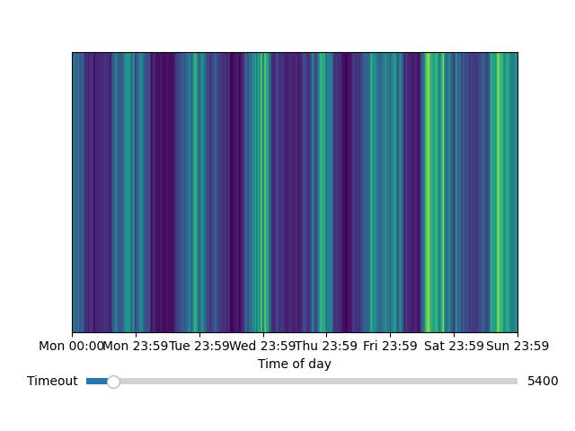

This is just a tool for taking activity "heartbeats" (where something outputs what it is currently doing periodically) and making a few interesting charts and graphs with it using matplotlib.

This was originally written specifically for Wakatime data, but there's no reason it couldn't be applied to other things. For example, I am planning on using this with Discord rich presense activity exports.

### Example usage (Wakapi):
```py
from sqlite3 import connect
from datetime import datetime
from heartbeats_data import HeartbeatData, show

print("Reading data")
conn = connect("../wakapi_db.db")
cur = conn.cursor()
hbs = cur.execute("SELECT project,time FROM heartbeats WHERE user_id='hopperelec'").fetchall()

print("Parsing data")
hb_data = HeartbeatData()
for hb in hbs:
    hb_data.add_hb(hb[0], datetime.strptime(hb[1][:19]+hb[1][-6:], "%Y-%m-%d %H:%M:%S%z"))

print("Producing legend")
hb_data.legend(ncol=2)

print("Plotting data")
# hb_data.plot_scatter()
hb_data.plot_durations(slider_kwargs={"default": 900})
# hb_data.plot_duration_counts(False, True, slider_kwargs={"default": 5400})

print("Displaying plot")
show()
```

### Samples
(using the above code, all with the same data)






